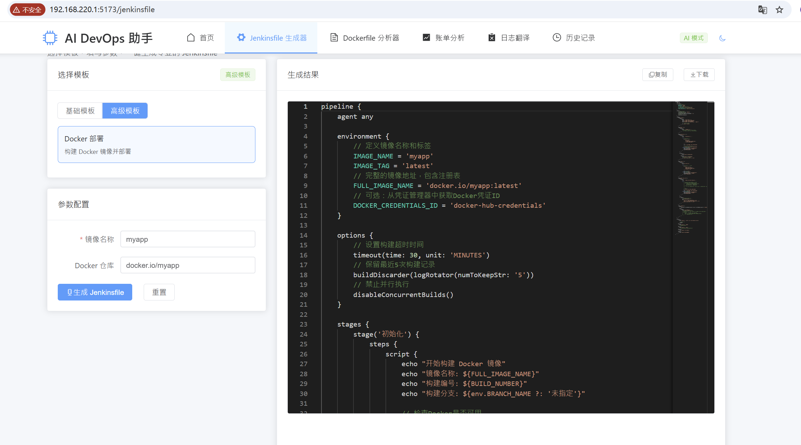
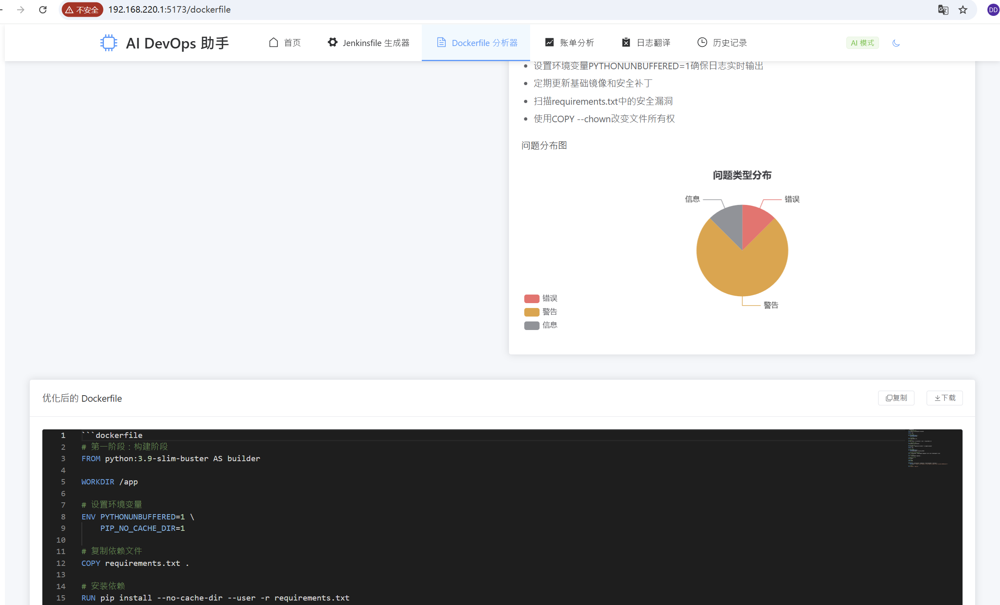
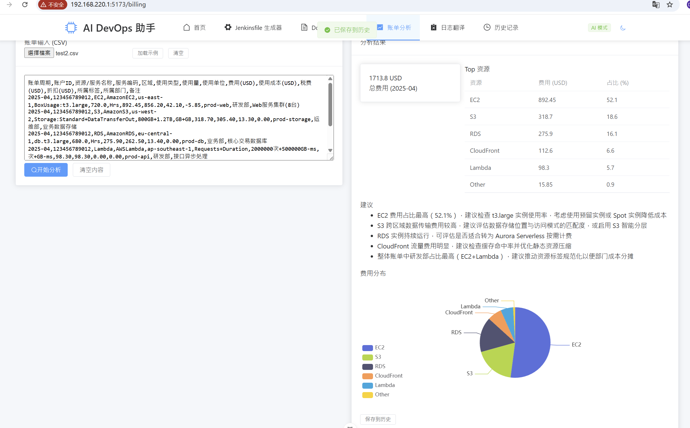
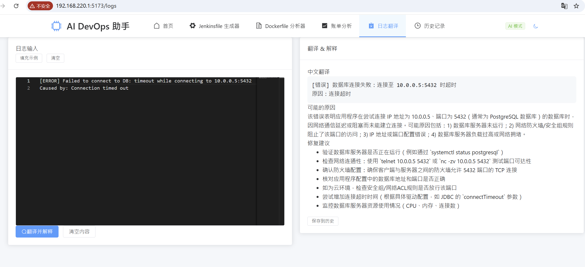

# AI DevOps 助手 - Vue3 实现
一个轻量、开源的 AI 辅助 DevOps 工具，专注于 Jenkinsfile 生成 + Dockerfile 分析，让 DevOps 工作更高效！
项目默认使用科大讯飞 Lite模型, 注册就能免费无限量调用，但是该ai模型较差，经常不按照模板回复。
官网：https://www.xfyun.cn/
该工具分析能力取决于使用的ai大模型能力。

## 📸 项目截图（示例）
### Jenkinsfile 生成器


### Dockerfile 分析器
分析Dockfile是否有异常


### AWS 账单 AI 解释器：
用户上传 AWS 账单 CSV（或导入 Mock 数据），AI 自动分析 “哪些资源消耗最多”“是否有闲置资源可优化”，并生成可视化图表。



### 技术日志 AI 翻译 / 解释：
用户粘贴英文技术日志（如 Jenkins 报错、AWS 告警），AI 翻译成中文并解释错误原因、给出解决方案。


## ✨ 核心功能
1. Jenkinsfile AI 生成：选择模板 + 填写参数 → 一键生成专业 Jenkinsfile
2. Dockerfile AI 分析：粘贴代码 → 检测漏洞 + 可视化结果 + 优化建议
3. 本地历史记录：自动保存最近操作，支持复用和编辑
4. 开箱即用：默认 Mock 模式，无需 AI API 即可体验
5. AWS 账单分析：上传 CSV，AI 给出消耗排名、优化建议和可视化图表（Billing 页）。
6. 技术日志翻译与解释：粘贴英文日志，AI 返回中文翻译、原因分析与修复建议（Log 页）。

## 🛠️ 技术栈
- 核心框架：Vue3 + Vite + Pinia + Vue Router
- 关键依赖：Monaco Editor（代码编辑）、ECharts（可视化）、Element Plus（UI）、OpenAI API（AI 能力）
- 代码规范：ESLint + Prettier

## 🚀 快速开始

### 1. 克隆仓库
```bash
git clone https://github.com/lisikai1999/AI-DevopsKit.git
cd AI-DevopsKit
```

### 2. 安装依赖
```bash
npm install
```

### 3. 配置环境（必看）
- 复制示例 env 文件到项目根目录：
  - macOS / Linux: `cp .env.example .env`
  - Windows (PowerShell): `copy .env.example .env`

- 重要环境变量（在 `.env` 中设置）：
  - `VITE_APP_MODE`：`mock`（默认）或 `ai`。
    - `mock`：本地模拟响应，无需 API Key及其他设置，适合开发和演示。
    - `ai`：使用真实 AI 服务（必须配置下面的 API 变量）。
  - `VITE_OPENAI_API_KEY`：你在提供商处申请到的 API Key（仅在 `ai` 模式需要）。
  - `VITE_OPENAI_MODEL`：使用的模型，例如 `gpt-3.5-turbo`（默认 fallback）或自定义模型（仅在 `ai` 模式需要）。
  - api域名配置，设置 Vite 开发代理ai api后端
    为了在开发环境下把浏览器的请求转发到 AI 提供商（避免 CORS 或隐藏 API Key），请在 `vite.config.js` 中配置 `proxy` =>`/api/chat`=>`target` 指向一个支持 OpenAI 风格路径的 API 主机。（仅在 `ai` 模式需要）

    示例（对接 OpenAI）：
    ```js
    // vite.config.js
    proxy: {
    '/api/chat': {
        target: 'https://api.openai.com/',
        changeOrigin: true,
        rewrite: (path) => path.replace(/^\/api\/chat/, '')
    }
    }
    ```


注意：本项目的客户端会向 `/api/chat/v1/chat/completions` 发送请求，以上 rewrite 会把它转换为 `/v1/chat/completions`，这在ai接口兼容OpenAI-compatible API（例如 OpenAI 官方、某些自托管或第三方代理）时能直接工作。如果使用的 API 路径不同，请调整 `rewrite` 或 `target` 来匹配目标接口。


**安全提示**：请勿将 `.env` 或 API Key 提交到仓库，项目已在 `.gitignore` 中忽略 `.env` 文件。生产环境应通过后端安全代理或 CI Secret 注入 API Key。
**重要**：在生产环境，不建议在前端直接使用第三方 API Key；应建立后端代理来统一管理密钥与限流策略。

### 4. 启动项目
```bash
npm run dev
```

打开浏览器并访问 `http://localhost:5173`。

---

## 📖 使用说明

### 1. Jenkinsfile 生成
- 进入「Jenkinsfile 生成器」页面
- 选择模板（基础 / 高级）
- 填写核心参数（仓库 URL、构建工具等）
- 点击「生成」，即可在编辑器中查看结果，支持复制 / 导出代码

### 2. Dockerfile 分析
- 进入「Dockerfile 分析器」页面
- 粘贴 Dockerfile 代码（或点击「填充示例」）
- 点击「分析」，查看漏洞分布和优化建议，支持复制 / 导出优化后代码

### Mock 与 AI 模式差异
- `mock` 模式：无需 API Key，项目使用内置模拟响应，便于离线开发。
- `ai` 模式：需要配置 `VITE_OPENAI_API_KEY` 与 `VITE_OPENAI_API_BASE_URL`，并确保开发代理或后端能正确转发 API 请求。

### 常见问题与排查建议
- 如果生成/分析失败并显示 API Key 未配置，请检查 `.env` 是否存在且 `VITE_APP_MODE=ai`，并重启 dev 服务。
- 代理请求没生效时，检查 `vite.config.js` 的 `proxy.target` 是否正确，查看终端中的 [Vite Proxy] 日志以获得更多信息。
- 若收到与 OpenAI API 不兼容的错误（路径或认证），建议用后端代理（推荐）或修改 `rewrite` 逻辑以匹配目标 API。

---

## 🔧 其它重要信息
- 历史记录：操作历史保存在 `localStorage` 的 `ai-devops-history` 键中，可在 `History` 页面查看并复用。
- Monaco 编辑器：在 `src/utils/monaco.js` 中已经有 Groovy 的基础高亮配置（用于 Jenkinsfile 编辑体验）。
- 代码风格：项目使用 ESLint + Prettier，建议在提交前运行格式化检查。

---

🤝 贡献指南
Fork 本仓库
创建分支（git checkout -b feature/xxx）
提交修改（git commit -m 'feat: 新增 xxx 功能'）
推送分支（git push origin feature/xxx）
提交 Pull Request