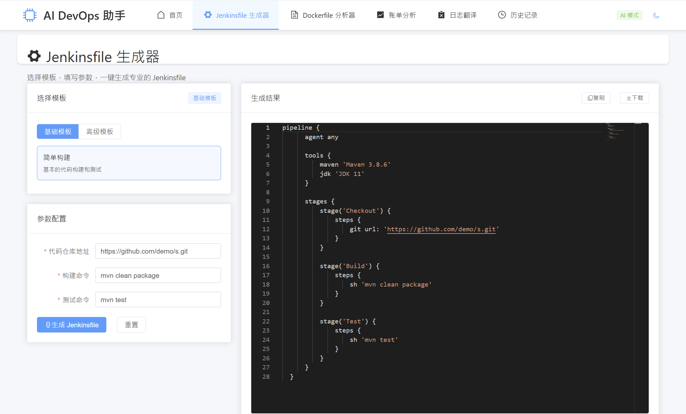
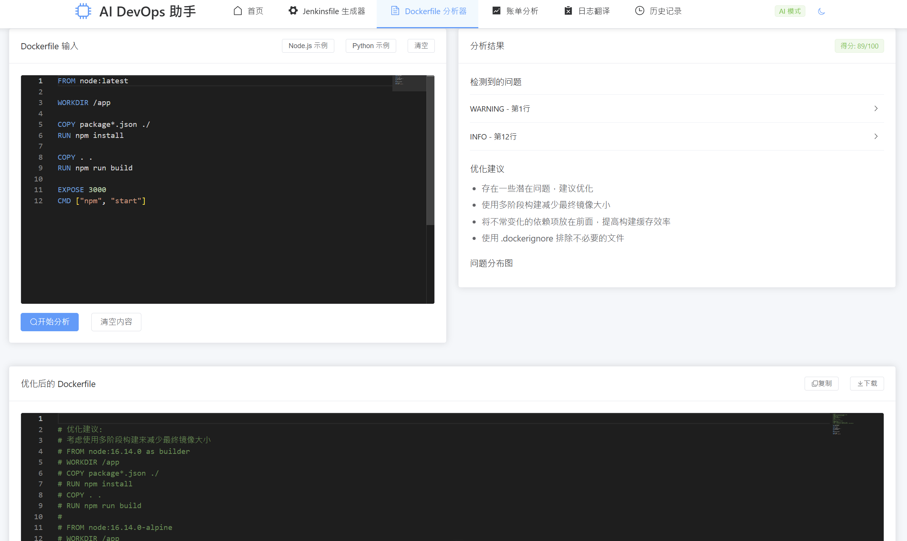
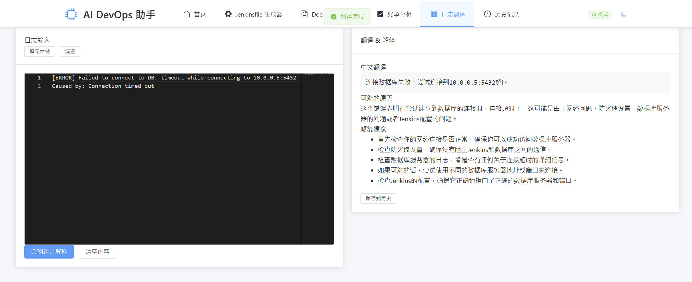

# AI DevOps 助手 - Vue3 实现
一个轻量、开源的 AI 辅助 DevOps 工具，专注于 Jenkinsfile 生成 + Dockerfile 分析，让 DevOps 工作更高效！
项目默认使用科大讯飞 Lite模型, 注册就能免费无限量调用
官网：https://www.xfyun.cn/

## 📸 项目截图（示例）
### Jenkinsfile 生成器


### Dockerfile 分析器


### AWS 账单 AI 解释器：
用户上传 AWS 账单 CSV（或导入 Mock 数据），AI 自动分析 “哪些资源消耗最多”“是否有闲置资源可优化”，并生成可视化图表。


### 技术日志 AI 翻译 / 解释：
用户粘贴英文技术日志（如 Jenkins 报错、AWS 告警），AI 翻译成中文并解释错误原因、给出解决方案。

## ✨ 核心功能
1. Jenkinsfile AI 生成：选择模板 + 填写参数 → 一键生成专业 Jenkinsfile
2. Dockerfile AI 分析：粘贴代码 → 检测漏洞 + 可视化结果 + 优化建议
3. 本地历史记录：自动保存最近操作，支持复用和编辑
4. 开箱即用：默认 Mock 模式，无需 AI API 即可体验
5. AWS 账单分析：上传 CSV，AI 给出消耗排名、优化建议和可视化图表（Billing 页）。
6. 技术日志翻译与解释：粘贴英文日志，AI 返回中文翻译、原因分析与修复建议（Log 页）。

## 🛠️ 技术栈
- 核心框架：Vue3 + Vite + Pinia + Vue Router
- 关键依赖：Monaco Editor（代码编辑）、ECharts（可视化）、Element Plus（UI）、OpenAI API（AI 能力）
- 代码规范：ESLint + Prettier

## 🚀 快速开始
### 1. 克隆仓库
```bash
git clone https://github.com/你的用户名/ai-devops-helper.git
cd ai-devops-helper
```

### 2. 安装依赖
```bash
运行
npm install
```

### 3. 配置环境变量（可选）
复制 .env.example 为 .env，根据需求修改：

# 默认为 mock 模式，无需修改即可运行
VITE_APP_MODE=mock

### 4. 启动项目
```bash
运行
npm run dev
```

浏览器访问 http://localhost:5173 即可使用。


📖 使用说明
### 1. Jenkinsfile 生成
进入「Jenkinsfile 生成器」页面
选择模板（基础 / 高级）
填写核心参数（仓库 URL、构建工具等）
点击「生成」，即可在编辑器中查看结果
支持复制 / 导出代码

### 2. Dockerfile 分析
进入「Dockerfile 分析器」页面
粘贴 Dockerfile 代码（或点击「填充示例」）
点击「分析」，查看漏洞分布和优化建议
支持复制 / 导出优化后代码
🔧 进阶配置（对接 AI API）
申请 OpenAI/Gemini API Key
修改 .env 文件：
env
VITE_APP_MODE=ai
VITE_OPENAI_API_KEY=你的 API Key
VITE_OPENAI_API_BASE_URL=https://api.openai.com/v1
重启项目即可使用真实 AI 能力

🤝 贡献指南
Fork 本仓库
创建分支（git checkout -b feature/xxx）
提交修改（git commit -m 'feat: 新增 xxx 功能'）
推送分支（git push origin feature/xxx）
提交 Pull Request